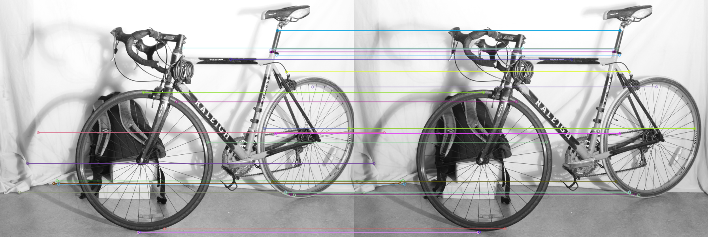
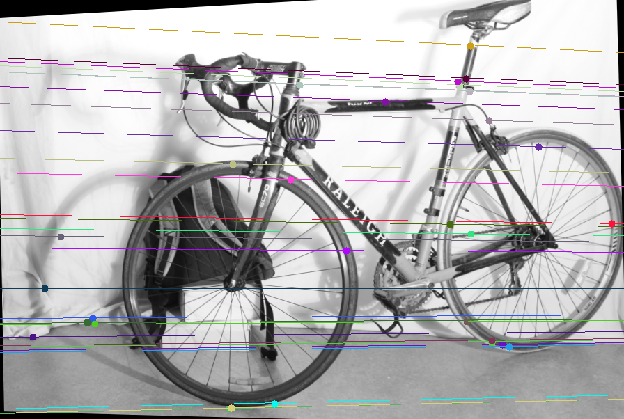
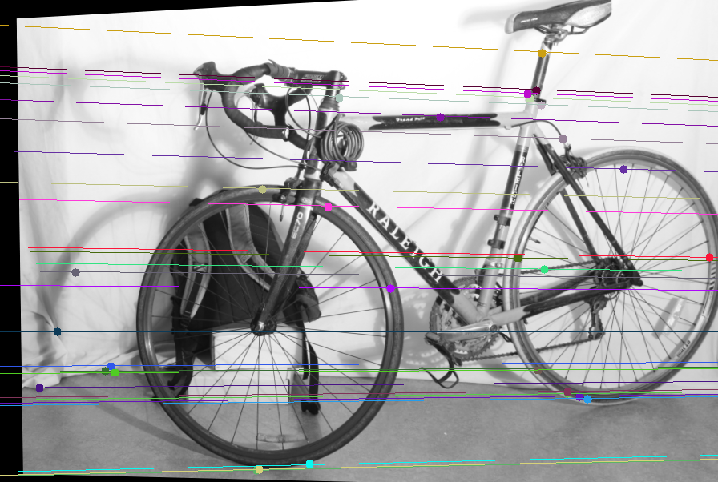
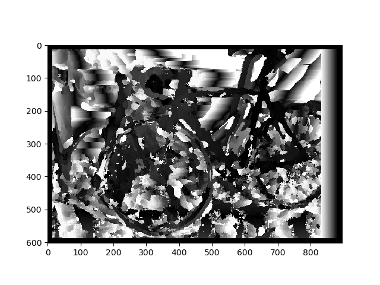
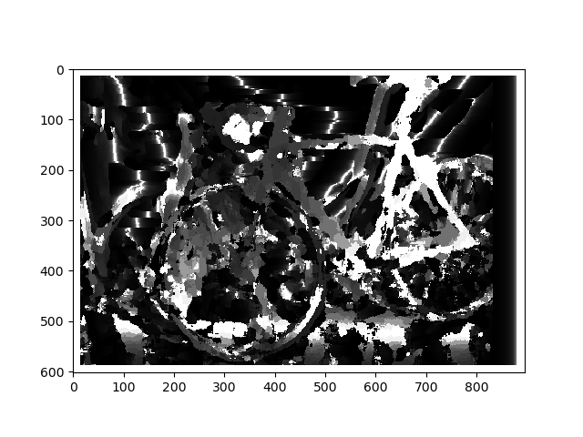

# Depth-estimation-using-stereovision
In this project, the concept of Stereo Vision is implemented. The Pipeline includes Calibration (Estimation of Essential Matrix), Plane Rectification, Block Matching for Pixel Correspondence. 

---
## Pipeline

### Calibration
The left and right images are shown below.


1) Feature Detection And Matching

    a) The result is obtained using the Brute-Force matcher (SIFT) in OpenCV.  To filter these wrong feature pairs, we will use RANSAC in the next step.

    b) The matches are sorted based on hemming distance and 30 best matches are
    selected from the total matches for the RANSAC section.




2) Calculating Fundamental matric using **RANSAC**

    The fundamental matrix is calculated using the 8-point algorithm. If the F matrix estimation is good, then terms features_2 * F * features_1 should be close to 0, where features_1 and features_2 are features from image1 and image2. Using this criterion, RANSAC can be used to filter the outliers.

3) Calculate the Essesntial Matrix
    Essential matrix is calculated using the Fundamental matrix and the intrinsic
    camera parameters.

4) Camera Pose Estimation

    a) The `ExtractCameraPose` function is used to extract the 4 camera pose solutions form the E matrix by
    calculating the svd of the E matrix as U Σ VT:

    b) The `DisambiguatePose` function is used to shortlist the best camera pose based on the triangulation check
    for the chirelity condition.

### Rectification
Using the fundamental matrix and the feature points, we can obtain the epipolar lines for both images. The epipolar lines need to be parallel for further computations to obtain depth. This can be done by reprojecting image planes onto a common plane parallel to the line between camera centers.




### Correspondance

For each pixel in the image we calculate disparity map using a sliding window and
sum of squared differences approach and save the grayscale and heatmap images. 



### Depth Map
If we know the focal length(f) and basline(b), the depth can be calculated.

    depth = (baseline*f)/disparity



## How to Run the Code
    ```
2) Run the following command:
  
    ```sh
    python main.py
    ```
---


